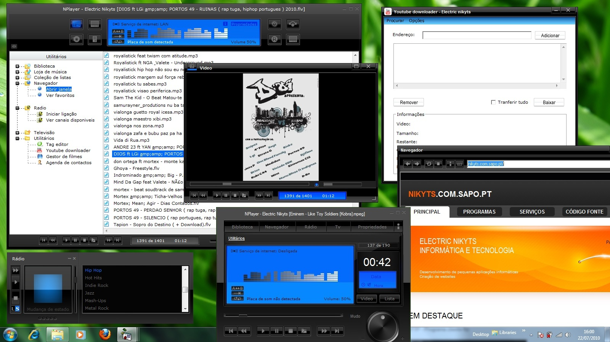



## NPlayer \(Media player\)

### Description

Example of how to create a media player. This was my first attempt at creating a media player so will not be expecting something professional: S. I still have a lot to learn but only after all the experience is that it gets better. I hope you enjoy ...
 
### More Info
 

             |
---                |---
**Submitted On**   |2011-04-13 15:42:00
**By**             |[Nikyts](https://github.com/Planet-Source-Code/PSCIndex/blob/master/ByAuthor/nikyts.md)
**Level**          |Intermediate
**User Rating**    |4.3 (26 globes from 6 users)
**Compatibility**  |VB 6\.0
**Category**       |[Sound/MP3](https://github.com/Planet-Source-Code/PSCIndex/blob/master/ByCategory/sound-mp3__1-45.md)
**World**          |[Visual Basic](https://github.com/Planet-Source-Code/PSCIndex/blob/master/ByWorld/visual-basic.md)
**Archive File**   |[Nikyts2201844132011\.zip](https://github.com/Planet-Source-Code/nikyts-nplayer-media-player__1-73854/archive/master.zip)

